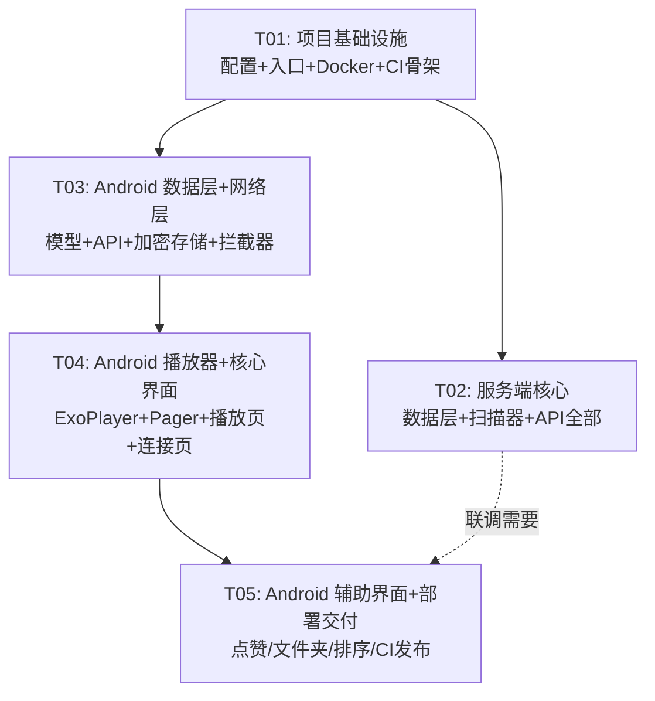

# NASee 系统架构设计文档

| 项目信息 | |
|---|---|
| **项目名称** | NASee |
| **文档版本** | v1.0 |
| **架构师** | 高见远 (Gao) |
| **基于 PRD** | NASee_PRD.md v1.0 |

---

## Part A: 系统设计

### 1. 实现方案 + 框架选型

#### 1.1 核心技术挑战

| 挑战 | 分析 | 方案 |
|------|------|------|
| **HTTP Range 流式播放** | 需支持 `Range: bytes=` 请求，返回 `206 Partial Content`，支持 Seek 和断点续传 | Go 标准库 `http.ServeContent` 原生支持 Range 请求，零额外开发 |
| **ffprobe 并发限流** | ≤ 2 并发，单文件超时 ≤ 30s，扫描不能影响 API 响应 | 信号量控制并发 + `context.WithTimeout` + 后台 goroutine |
| **增量扫描** | 避免每次全量扫描，仅处理新增/修改/删除的文件 | 记录 `mod_time`，对比文件系统时间戳决定是否需要重新探测 |
| **抖音式竖屏滑动 + 秒开** | 滑动切换瞬间播放，无黑屏无缓冲 | ExoPlayer 三实例池（prev/current/next）+ 预加载 `prepare()` |
| **液态玻璃 UI** | 半透明模糊背景、圆润控件、Material3 | Compose `Modifier.blur()` + `GraphicsLayer` + 半透明色值 |
| **FN Connect 反向代理兼容** | 所有地址使用相对路径，不硬编码绝对 URL | API 返回相对路径 `stream_url: "/api/v1/videos/1/stream"`，客户端拼接 baseUrl |
| **加密存储连接信息** | 地址和密码需加密，root 设备也无法直接读取 | `EncryptedSharedPreferences` + Android Keystore 主密钥 |

#### 1.2 服务端框架选型

| 组件 | 选型 | 理由 |
|------|------|------|
| **HTTP 路由** | Go 1.22+ 标准库 `net/http` (ServeMux pattern routing) | PRD 要求"最少依赖"；Go 1.22 原生支持 `GET /api/v1/videos/{id}` 模式路由 + `http.ServeContent` 原生处理 Range |
| **SQLite 驱动** | `modernc.org/sqlite` | 纯 Go 实现，无 CGO 依赖，Docker 多架构构建（amd64/arm64）无需交叉编译工具链 |
| **ffprobe 调用** | `os/exec` + 信号量 | 标准库直接调用 ffprobe 二进制，channel 信号量控制并发 ≤ 2 |
| **JSON 序列化** | `encoding/json` (标准库) | 无需第三方库 |
| **日志** | `log/slog` (标准库, Go 1.21+) | 结构化日志，零依赖 |

**架构模式**: 简洁分层架构 — `cmd` (入口) → `internal/api` (HTTP 层) → `internal/storage` (数据层) + `internal/scanner` (后台服务) + `internal/media` (媒体服务)

#### 1.3 客户端框架选型

| 组件 | 选型 | 理由 |
|------|------|------|
| **UI 框架** | Jetpack Compose (BOM 2024.x) | 声明式 UI，天然支持 `VerticalPager` 竖屏滑动 |
| **视频播放** | Media3 ExoPlayer 1.x | PRD 指定；支持自定义 DataSource（带 Auth Header）、预加载、Seek |
| **网络请求** | Retrofit2 + OkHttp4 | 类型安全 API 接口；OkHttp Interceptor 注入认证头 |
| **图片加载** | Coil2 (coil-compose) | Compose 原生支持，用于缩略图（P1）和占位图 |
| **加密存储** | androidx.security:security-crypto | `EncryptedSharedPreferences` 基于 Android Keystore |
| **偏好存储** | androidx.datastore:datastore-preferences | 非敏感配置（排序方式、上次文件夹等） |
| **导航** | androidx.navigation:navigation-compose | Compose 原生导航 |
| **依赖注入** | 手动 DI（Application 持有容器） | 避免 Hilt/KDG 增加构建复杂度，项目规模小适合手动管理 |

**架构模式**: MVVM — `ViewModel` (状态管理) + `Compose` (视图) + `Repository/ApiService` (数据)

---

### 2. 文件列表及相对路径

```
NASee/
├── server/
│   ├── go.mod                                    # Go 模块定义
│   ├── go.sum                                    # 依赖校验
│   ├── Dockerfile                                # 多阶段构建 (Go build + Alpine + ffmpeg)
│   ├── cmd/
│   │   └── nasee-server/
│   │       └── main.go                           # 入口：加载配置→初始化DB→启动扫描→启动HTTP
│   └── internal/
│       ├── config/
│       │   └── config.go                         # 环境变量读取，默认值，校验
│       ├── models/
│       │   ├── video.go                          # Video 结构体 + VideoMeta + VideoFilter
│       │   ├── like.go                           # LikeResponse 结构体
│       │   └── dto.go                            # API 请求/响应 DTO (VideoListResponse, FolderNode, ApiResponse)
│       ├── storage/
│       │   ├── db.go                             # SQLite 连接初始化 + Close
│       │   ├── schema.go                         # 建表 SQL + Migrate()
│       │   ├── video_repo.go                     # 视频 CRUD：List/GetByID/Upsert/Delete/GetFolders/MarkStale
│       │   └── like_repo.go                      # 点赞 CRUD：GetLikeStatus/ToggleLike/ListLiked
│       ├── scanner/
│       │   ├── scanner.go                        # 目录遍历 + 增量判断 + 定时循环
│       │   ├── ffprobe.go                        # ffprobe 调用封装 + JSON 解析
│       │   └── worker.go                         # 并发信号量 + 超时控制
│       ├── media/
│       │   └── stream.go                         # http.ServeContent 封装，Content-Type 映射
│       └── api/
│           ├── router.go                         # ServeMux 路由注册 + 依赖注入容器
│           ├── middleware.go                      # AuthMiddleware (X-NASee-Key 校验) + CORS + 日志
│           └── handlers/
│               ├── video_handler.go              # GET /videos (分页/筛选/排序), GET /folders
│               ├── like_handler.go               # GET/POST /videos/{id}/like, GET /videos/liked
│               ├── stream_handler.go             # GET /videos/{id}/stream (Range 流式)
│               └── health_handler.go             # GET /health
│
├── android/
│   ├── settings.gradle.kts                       # 仓库配置 + 项目名称
│   ├── build.gradle.kts                          # 根构建文件 (插件声明)
│   ├── gradle.properties                         # Gradle/JVM 配置
│   ├── app/
│   │   ├── build.gradle.kts                      # 应用构建配置 + 依赖声明 + 签名配置
│   │   ├── proguard-rules.pro                    # ProGuard 混淆规则
│   │   └── src/main/
│   │       ├── AndroidManifest.xml               # 权限 + 主题 + Activity 声明
│   │       ├── java/com/nasee/app/
│   │       │   ├── NASeeApplication.kt           # Application 类 + 手动 DI 容器
│   │       │   ├── MainActivity.kt               # 单 Activity 入口 + NavHost
│   │       │   ├── data/
│   │       │   │   ├── model/
│   │       │   │   │   ├── Video.kt              # Video 数据类 + VideoListResponse
│   │       │   │   │   ├── FolderNode.kt         # 文件夹树节点
│   │       │   │   │   ├── LikeResponse.kt       # 点赞响应
│   │       │   │   │   └── ServerConfig.kt       # 连接配置数据类
│   │       │   │   ├── remote/
│   │       │   │   │   ├── ApiService.kt         # Retrofit 接口定义
│   │       │   │   │   └── ApiClient.kt          # Retrofit/OkHttp 创建 + baseUrl 切换
│   │       │   │   └── local/
│   │       │   │       ├── EncryptedConfigStore.kt  # 加密存储 (Keystore + EncryptedSharedPreferences)
│   │       │   │       └── SettingsDataStore.kt     # 非敏感偏好 (排序/文件夹/仅点赞)
│   │       │   ├── network/
│   │       │   │   └── AuthInterceptor.kt        # OkHttp Interceptor 注入 X-NASee-Key
│   │       │   ├── player/
│   │       │   │   ├── VideoPlayerManager.kt     # ExoPlayer 实例池管理 (prev/current/next)
│   │       │   │   ├── PreloadManager.kt         # 预加载协调 (preload + release distant)
│   │       │   │   └── PlayerFactory.kt          # ExoPlayer 创建 + DataSource 配置 (Auth Header)
│   │       │   └── ui/
│   │       │       ├── theme/
│   │       │       │   ├── Color.kt              # 液态玻璃配色
│   │       │       │   ├── Theme.kt              # Material3 主题 + 深色/浅色
│   │       │       │   ├── Type.kt               # 字体
│   │       │       │   └── Shapes.kt             # 圆角形状
│   │       │       ├── components/
│   │       │       │   ├── VideoPager.kt         # VerticalPager 封装 + 页面切换回调
│   │       │       │   ├── VideoPlayerSurface.kt # Player Surface + 缩放模式
│   │       │       │   ├── GestureOverlay.kt     # 单击/双击/拖动手势检测
│   │       │       │   ├── ProgressBar.kt        # 可拖动进度条 + 时间显示
│   │       │       │   ├── LikeButton.kt         # 心形按钮 + 缩放动画 + 粒子效果
│   │       │       │   ├── SideActionRail.kt     # 右侧操作栏 (点赞/文件夹/排序)
│   │       │       │   ├── VideoInfoBar.kt       # 底部标题 + 路径信息栏
│   │       │       │   ├── LiquidGlassCard.kt   # 液态玻璃容器组件
│   │       │       │   ├── FolderBottomSheet.kt  # 文件夹树 BottomSheet
│   │       │       │   └── SortMenu.kt           # 排序下拉菜单
│   │       │       ├── screens/
│   │       │       │   ├── ConnectionScreen.kt   # 连接设置页
│   │       │       │   ├── PlayerScreen.kt       # 播放页 (核心界面)
│   │       │       │   └── LikedVideosScreen.kt  # 点赞列表页
│   │       │       └── viewmodel/
│   │       │           ├── PlayerViewModel.kt    # 播放页状态管理
│   │       │           ├── ConnectionViewModel.kt # 连接页状态管理
│   │       │           └── LikedViewModel.kt     # 点赞列表状态管理
│   │       └── res/values/
│   │           ├── strings.xml                   # 字符串资源
│   │           ├── colors.xml                    # 颜色资源
│   │           └── themes.xml                    # 主题资源
│   └── keystore/
│       └── nasee-release.jks                     # Release 签名密钥 (本地生成, 不入库)
│
├── deploy/fnos/
│   └── docker-compose.yml                        # 飞牛 OS 一键部署模板
│
├── .github/workflows/
│   ├── ci.yml                                    # CI: 构建 + lint + 测试
│   └── release.yml                               # CD: 构建 APK + Docker → GHCR + GitHub Release
│
├── .gitignore                                    # 忽略规则
└── README.md                                     # 项目说明 + 部署指南
```

---

### 3. 数据结构和接口

#### 3.1 SQLite 表结构

```sql
-- videos 表：视频元数据
CREATE TABLE IF NOT EXISTS videos (
    id          INTEGER PRIMARY KEY AUTOINCREMENT,
    file_path   TEXT    NOT NULL UNIQUE,           -- 相对于 MediaDir 的路径，如 /movies/vacation.mp4
    title       TEXT    NOT NULL,                  -- 文件名（含扩展名）
    duration    REAL    NOT NULL DEFAULT 0,        -- 秒
    width       INTEGER NOT NULL DEFAULT 0,
    height      INTEGER NOT NULL DEFAULT 0,
    file_size   INTEGER NOT NULL DEFAULT 0,        -- 字节
    mod_time    INTEGER NOT NULL DEFAULT 0,        -- 文件修改时间 (Unix 时间戳)
    folder_path TEXT    NOT NULL DEFAULT '',       -- 父目录相对路径，如 /movies
    scanned_at  INTEGER NOT NULL DEFAULT 0,        -- 最后扫描时间 (Unix 时间戳)
    created_at  INTEGER NOT NULL DEFAULT (strftime('%s', 'now'))
);

CREATE INDEX IF NOT EXISTS idx_videos_folder ON videos(folder_path);
CREATE INDEX IF NOT EXISTS idx_videos_mod_time ON videos(mod_time);

-- likes 表：点赞记录
CREATE TABLE IF NOT EXISTS likes (
    id        INTEGER PRIMARY KEY AUTOINCREMENT,
    video_id  INTEGER NOT NULL UNIQUE,
    liked_at  INTEGER NOT NULL DEFAULT (strftime('%s', 'now')),
    FOREIGN KEY (video_id) REFERENCES videos(id) ON DELETE CASCADE
);

CREATE INDEX IF NOT EXISTS idx_likes_video_id ON likes(video_id);
```

#### 3.2 服务端 API 接口列表

**认证方式**: 所有 `/api/v1/*` 端点需要请求头 `X-NASee-Key: <password>`，`/health` 无需认证。

| Method | Path | 认证 | 说明 |
|--------|------|------|------|
| GET | `/health` | 否 | 健康检查 |
| GET | `/api/v1/videos` | 是 | 视频列表（分页/筛选/排序） |
| GET | `/api/v1/videos/{id}/stream` | 是 | 视频流（HTTP Range） |
| GET | `/api/v1/folders` | 是 | 文件夹树 |
| GET | `/api/v1/videos/{id}/like` | 是 | 获取点赞状态 |
| POST | `/api/v1/videos/{id}/like` | 是 | 切换点赞状态 |
| GET | `/api/v1/videos/liked` | 是 | 点赞视频列表 |
| POST | `/api/v1/scan` | 是 | 手动触发增量扫描 |

**统一响应格式**:
```json
{
  "code": 0,         // 0 = 成功, 非 0 = 错误 (通常等于 HTTP 状态码)
  "data": { ... },   // 业务数据, 错误时为 null
  "message": "ok"    // 描述信息
}
```

**GET /api/v1/videos** — 视频列表

Query 参数:
| 参数 | 类型 | 默认 | 说明 |
|------|------|------|------|
| page | int | 1 | 页码 |
| page_size | int | 20 | 每页数量 (max 100) |
| folder | string | "" | 文件夹筛选 (空 = 全部) |
| sort | string | "mod_time" | 排序字段: name / mod_time / file_size / duration |
| order | string | "desc" | 排序方向: asc / desc |
| liked_only | bool | false | 仅返回点赞视频 |

响应:
```json
{
  "code": 0,
  "data": {
    "videos": [
      {
        "id": 1,
        "title": "vacation.mp4",
        "duration": 120.5,
        "size": 104857600,
        "path": "/movies/vacation.mp4",
        "folder": "/movies",
        "width": 1920,
        "height": 1080,
        "liked": false,
        "stream_url": "/api/v1/videos/1/stream",
        "mod_time": 1700000000
      }
    ],
    "total": 150,
    "page": 1,
    "page_size": 20
  },
  "message": "ok"
}
```

**GET /api/v1/videos/{id}/stream** — 视频流

- 请求头: `Range: bytes=0-` (可选)
- 响应: `206 Partial Content` + `Content-Range: bytes 0-XXX/total` 或 `200 OK` (无 Range)
- Content-Type: 根据文件扩展名映射 (video/mp4, video/x-matroska, etc.)
- 直接使用 `http.ServeContent` 处理

**GET /api/v1/folders** — 文件夹树

响应:
```json
{
  "code": 0,
  "data": {
    "folders": [
      {
        "path": "/",
        "name": "全部视频",
        "count": 10,
        "children": [
          {
            "path": "/movies",
            "name": "movies",
            "count": 50,
            "children": []
          }
        ]
      }
    ]
  },
  "message": "ok"
}
```

**POST /api/v1/videos/{id}/like** — 切换点赞

响应:
```json
{
  "code": 0,
  "data": {
    "video_id": 1,
    "liked": true
  },
  "message": "ok"
}
```

**错误响应**:
```json
{
  "code": 401,
  "data": null,
  "message": "unauthorized: missing or invalid API key"
}
```

#### 3.3 客户端核心数据类

```kotlin
// data/model/Video.kt
data class Video(
    val id: Long,
    val title: String,
    val duration: Double,        // 秒
    val size: Long,              // 字节
    val path: String,            // 相对路径
    val folder: String,
    val width: Int,
    val height: Int,
    val liked: Boolean,
    val streamUrl: String,       // 相对路径 /api/v1/videos/{id}/stream
    val modTime: Long
)

data class VideoListResponse(
    val videos: List<Video>,
    val total: Int,
    val page: Int,
    val pageSize: Int
)

// data/model/FolderNode.kt
data class FolderNode(
    val path: String,
    val name: String,
    val count: Int,
    val children: List<FolderNode>
)

// data/model/LikeResponse.kt
data class LikeResponse(
    val videoId: Long,
    val liked: Boolean
)

// data/model/ServerConfig.kt
data class ServerConfig(
    val address: String,          // 内网地址, 如 http://192.168.1.100:8080
    val externalAddress: String?, // 外网地址 (FN Connect), 可选
    val password: String
) {
    // 获取当前生效的 base URL (内网优先, 不可用切外网)
    fun activeBaseUrl(useExternal: Boolean = false): String =
        if (useExternal && !externalAddress.isNullOrBlank()) externalAddress!! else address

    // 拼接完整流地址
    fun fullStreamUrl(streamUrl: String, useExternal: Boolean = false): String =
        activeBaseUrl(useExternal) + streamUrl
}
```

#### 3.4 类图

> 完整类图见 `docs/class-diagram.mermaid`

---

### 4. 程序调用流程

> 完整时序图见 `docs/sequence-diagram.mermaid`

#### 4.1 视频扫描流程 (摘要)

```
main.go 启动 → Config.Load() → Database.New() + Migrate()
  → Scanner.Start(ctx) [goroutine]
    → 循环: filepath.Walk(MediaDir)
      → 按扩展名过滤视频文件
      → 对每个文件: 检查 DB 中 FilePath + ModTime
        → 新增/修改 → FFProbeWorker.Probe() [信号量限流 ≤ 2, 超时 30s]
          → exec ffprobe → 解析 JSON → VideoMeta
          → VideoRepo.Upsert(Video)
        → 未变 → 跳过
      → VideoRepo.MarkStale() → 删除已不存在的记录
    → sleep(ScanInterval)
```

#### 4.2 客户端连接 + 获取列表 + 播放流程 (摘要)

```
App 启动 → ConnectionViewModel.loadSavedConfig()
  → EncryptedConfigStore.loadConfig()
    → null (首次) → 显示 ConnectionScreen
    → 有值 → 跳过连接页

ConnectionScreen:
  用户输入地址 + 密码 → testConnection()
    → ApiService GET /health (X-NASee-Key)
    → 成功 → saveConfig() → EncryptedConfigStore.saveConfig()
    → 导航到 PlayerScreen

PlayerScreen:
  PlayerViewModel.loadVideos()
    → ApiService GET /api/v1/videos?page=1
    → 返回视频列表
  → VideoPlayerManager.getOrCreatePlayer(videos[0])
    → ExoPlayer.setMediaItem(baseUrl + streamUrl, headers{X-NASee-Key})
    → prepare() → play()
  → PreloadManager.preload(videos, 0)
    → getOrCreatePlayer(videos[1]) → prepare()
  → 用户上滑 → VerticalPager settle
    → 切换 currentPlayer → 已预加载, 秒开
    → 释放远端 Player, 预加载下一个
  → 滚动到底部 → loadMore() → GET /api/v1/videos?page=2
```

#### 4.3 点赞流程 (摘要)

```
用户双击/点击心形 → UI 立即播放动画
  → PlayerViewModel.toggleLike(videoId)
    → optimistic update (本地先翻转 liked 状态)
    → ApiService POST /api/v1/videos/{id}/like
      → LikeHandler → LikeRepo.ToggleLike → SQLite INSERT/DELETE
      → 返回 {video_id, liked}
    → 成功: 保持 UI 状态
    → 失败: 回滚 UI 状态 + toast 提示
```

---

### 5. 待明确事项 (UNCLEAR)

| 编号 | 问题 | 当前假设 | 需确认 |
|------|------|---------|--------|
| U-01 | GHCR `<account>` 用户名/组织名 | 使用占位符 `<account>` | 需用户提供 GitHub 账号名，用于 Docker 镜像地址和 CI 发布 |
| U-02 | 默认服务端口是否与飞牛 OS 冲突 | 使用 8080 (PRD 建议) | 需确认飞牛 OS 是否已占用 8080 |
| U-03 | 缩略图是否纳入 MVP | MVP 不实现缩略图，列表使用占位图；P1 再实现 | 与 PM 确认 |
| U-04 | 视频格式白名单范围 | `.mp4 .mkv .avi .mov .ts .flv .webm .m4v .wmv` | 与 PM 确认是否需要增减 |
| U-05 | 内外网自动切换策略 | P1 仅手动切换，P2 考虑自动检测 | 与 PM 确认 |
| U-06 | 多用户支持 | MVP 单用户单密码模式 | 与 PM 确认 |
| U-07 | APK release keystore 密钥信息 | 工程师生成本地 keystore，CI 中通过 GitHub Secrets 注入 | 需用户提供或确认方案 |
| U-08 | 扫描触发时机 | 启动时自动扫描 + 定时扫描(默认1小时) + 手动触发 | 与 PM 确认默认间隔 |

---

## Part B: 任务分解

### 6. 依赖包列表

#### 6.1 Go 依赖 (server/go.mod)

```
module nasee-server

go 1.22

require (
    modernc.org/sqlite v1.29.0   // 纯 Go SQLite 驱动，无 CGO
)
// 其余均使用标准库: net/http, encoding/json, os/exec, path/filepath, log/slog, context, time, sync
```

#### 6.2 Android 依赖 (android/app/build.gradle.kts)

```kotlin
// Compose BOM
implementation(platform("androidx.compose:compose-bom:2024.10.00"))
implementation("androidx.compose.ui:ui")
implementation("androidx.compose.ui:ui-graphics")
implementation("androidx.compose.material3:material3")
implementation("androidx.compose.foundation:foundation")
implementation("androidx.activity:activity-compose:1.9.3")
implementation("androidx.navigation:navigation-compose:2.8.4")
implementation("androidx.lifecycle:lifecycle-viewmodel-compose:2.8.7")
implementation("androidx.lifecycle:lifecycle-runtime-compose:2.8.7")

// Media3 ExoPlayer
implementation("androidx.media3:media3-exoplayer:1.4.1")
implementation("androidx.media3:media3-ui:1.4.1")
implementation("androidx.media3:media3-common:1.4.1")
implementation("androidx.media3:media3-datasource:1.4.1")
implementation("androidx.media3:media3-datasource-okhttp:1.4.1")  // OkHttp DataSource for auth headers

// Networking
implementation("com.squareup.retrofit2:retrofit:2.11.0")
implementation("com.squareup.retrofit2:converter-gson:2.11.0")
implementation("com.squareup.okhttp3:logging-interceptor:4.12.0")

// Image loading
implementation("io.coil-kt:coil-compose:2.7.0")

// Security & Storage
implementation("androidx.security:security-crypto:1.1.0-alpha06")
implementation("androidx.datastore:datastore-preferences:1.1.1")

// JSON
implementation("com.google.code.gson:gson:2.11.0")
```

#### 6.3 Docker 基础镜像

```dockerfile
# 构建阶段
FROM golang:1.22-alpine AS builder

# 运行阶段
FROM alpine:3.20
RUN apk add --no-cache ffmpeg    # 提供 ffprobe 二进制
```

---

### 7. 任务列表 (工程师实现指南)

> ⚠️ 严格按 T01 → T05 顺序实现。每个任务内部文件可并行编写，但任务间有依赖。

---

#### T01: 项目基础设施 (配置 + 入口 + Docker + CI 骨架)

**涉及文件** (13 个):
```
server/go.mod
server/cmd/nasee-server/main.go
server/Dockerfile
android/settings.gradle.kts
android/build.gradle.kts
android/gradle.properties
android/app/build.gradle.kts
android/app/proguard-rules.pro
android/app/src/main/AndroidManifest.xml
android/app/src/main/java/com/nasee/app/NASeeApplication.kt
deploy/fnos/docker-compose.yml
.github/workflows/ci.yml
README.md
```

**依赖**: 无 (第一个任务)

**实现要点**:

1. **server/go.mod**: `module nasee-server`, `go 1.22`, require `modernc.org/sqlite`
2. **server/cmd/nasee-server/main.go**: 完整入口流程——读取环境变量配置 → 初始化 SQLite → 执行迁移 → 启动后台扫描 goroutine → 注册 HTTP 路由 → `http.ListenAndServe`。此文件引用的 `internal/*` 包此阶段可先写空壳函数/stub，确保 `go build` 通过即可。
3. **server/Dockerfile**: 多阶段构建，builder 用 `golang:1.22-alpine` + `CGO_ENABLED=0 go build`，runtime 用 `alpine:3.20` + `apk add ffmpeg`。HEALTHCHECK 指向 `/health`。
4. **android/settings.gradle.kts**: `pluginManagement` + `dependencyResolutionManagement` (google + mavenCentral)
5. **android/build.gradle.kts**: 声明 AGP + Kotlin 插件版本 (AGP 8.7+, Kotlin 2.0+)
6. **android/app/build.gradle.kts**: `compileSdk 35`, `minSdk 31`, `targetSdk 35`; 声明全部依赖 (见 §6.2); 配置 release 签名 (从 `keystore/nasee-release.jks` 读取，密码从 `local.properties` 或环境变量); 开启 Compose (`buildFeatures { compose = true }`)
7. **AndroidManifest.xml**: `INTERNET` 权限; 单 `MainActivity` + `@android:style/Theme.Material.NoActionBar`; `android:usesCleartextTraffic="true"` (内网 HTTP)
8. **NASeeApplication.kt**: 继承 `Application`，持有手动 DI 容器 (ApiClient, EncryptedConfigStore 等懒加载)
9. **docker-compose.yml**: 见共享知识 §8.4 的完整模板
10. **ci.yml**: on push/PR — Go build + test, Android assembleDebug
11. **README.md**: 项目简介 + 快速开始 (Docker 部署步骤 + App 连接步骤)

**验收**: `go build ./cmd/nasee-server` 通过；Android 项目 `./gradlew assembleDebug` 通过 (空 UI 即可)；`docker compose up` 能启动容器 (虽然 API 还没实现)

---

#### T02: 服务端核心 (数据层 + 扫描器 + API 全部)

**涉及文件** (17 个):
```
server/internal/config/config.go
server/internal/models/video.go
server/internal/models/like.go
server/internal/models/dto.go
server/internal/storage/db.go
server/internal/storage/schema.go
server/internal/storage/video_repo.go
server/internal/storage/like_repo.go
server/internal/scanner/scanner.go
server/internal/scanner/ffprobe.go
server/internal/scanner/worker.go
server/internal/media/stream.go
server/internal/api/router.go
server/internal/api/middleware.go
server/internal/api/handlers/video_handler.go
server/internal/api/handlers/like_handler.go
server/internal/api/handlers/stream_handler.go
server/internal/api/handlers/health_handler.go
```

**依赖**: T01

**实现要点**:

1. **config.go**: 从环境变量读取所有配置，提供默认值 (见 §8.5)。校验 `MediaDir` 和 `Password` 必填。
2. **models/**: 定义 `Video`, `VideoMeta`, `VideoFilter`, `LikeResponse`, `FolderNode`, `ApiResponse`, `VideoListResponse` 结构体。JSON tag 使用 `snake_case`。
3. **storage/db.go**: 使用 `modernc.org/sqlite` 打开数据库，设置 `WAL` 模式 + `busy_timeout`。`Migrate()` 执行建表 SQL。
4. **storage/schema.go**: 包含 §3.1 的全部建表 SQL。
5. **storage/video_repo.go**:
   - `List(filter)`: 分页查询，支持 folder/liked_only 筛选 + sort/order 排序。SQL 动态拼接（注意 SQL 注入防护，sort/order 用白名单校验）。LEFT JOIN likes 表获取 liked 状态。
   - `GetByID(id)`: 单条查询。
   - `Upsert(v)`: `INSERT OR REPLACE`，用于扫描器写入。
   - `Delete(id)` / `DeleteByPath(path)`: 删除记录。
   - `GetFolders()`: 查询 `SELECT DISTINCT folder_path` + 按 `/` 分割构建树结构。
   - `MarkStale(scannedAt)`: 删除 `scanned_at < scannedAt` 的记录（已不存在的文件）。
6. **storage/like_repo.go**: `GetLikeStatus`, `ToggleLike` (INSERT or DELETE), `ListLiked` (JOIN videos + likes)。
7. **scanner/ffprobe.go**: 调用 `exec.CommandContext(ctx, ffprobePath, "-v", "quiet", "-print_format", "json", "-show_format", "-show_streams", filePath)`。解析 JSON 提取 duration/width/height。支持超时取消。
8. **scanner/worker.go**: channel 信号量控制并发 (cap = FFProbeConcurrency)。`Probe()` 方法获取信号量 → 调用 ffprobe → 释放。
9. **scanner/scanner.go**: `filepath.Walk` 遍历 MediaDir，按扩展名白名单过滤。对每个文件查询 DB 检查 ModTime，仅变更的提交 Worker。`Start(ctx)` 循环：`ScanOnce()` → `time.Sleep(ScanInterval)`。
10. **media/stream.go**: `http.ServeContent(w, r, title, modTime, file)` 封装。Content-Type 用扩展名映射表 (`mime.TypeByExtension` + 自定义补充)。打开文件前验证路径在 MediaDir 内（防目录穿越）。
11. **api/router.go**: 使用 Go 1.22 `http.NewServeMux()` 注册路由。`/health` 无 auth；`/api/v1/*` 包裹 AuthMiddleware。依赖注入：构造函数接收 repos 和 config。
12. **api/middleware.go**: `AuthMiddleware` 校验 `X-NASee-Key` header。可选 CORS 中间件。请求日志 (slog)。
13. **handlers/video_handler.go**: 解析 query params → 构造 `VideoFilter` → `VideoRepo.List()` → JSON 响应。
14. **handlers/like_handler.go**: path param `{id}` → `LikeRepo` 操作。
15. **handlers/stream_handler.go**: path param `{id}` → `VideoRepo.GetByID()` → 验证文件存在 → `media.Stream()`。
16. **handlers/health_handler.go**: 返回 `{"status":"ok"}`。

**验收**: `curl -H "X-NASee-Key: test" http://localhost:8080/api/v1/videos` 返回 JSON 列表；`curl -H "X-NASee-Key: test" -H "Range: bytes=0-1023" http://localhost:8080/api/v1/videos/1/stream -o /dev/null -w "%{http_code}"` 返回 206；扫描器能扫描测试视频目录并入库。

---

#### T03: Android 数据层 + 网络层

**涉及文件** (10 个):
```
android/app/src/main/java/com/nasee/app/data/model/Video.kt
android/app/src/main/java/com/nasee/app/data/model/FolderNode.kt
android/app/src/main/java/com/nasee/app/data/model/LikeResponse.kt
android/app/src/main/java/com/nasee/app/data/model/ServerConfig.kt
android/app/src/main/java/com/nasee/app/data/remote/ApiService.kt
android/app/src/main/java/com/nasee/app/data/remote/ApiClient.kt
android/app/src/main/java/com/nasee/app/data/local/EncryptedConfigStore.kt
android/app/src/main/java/com/nasee/app/data/local/SettingsDataStore.kt
android/app/src/main/java/com/nasee/app/network/AuthInterceptor.kt
android/app/src/main/java/com/nasee/app/MainActivity.kt
```

**依赖**: T01

**实现要点**:

1. **data/model/*.kt**: 按 §3.3 定义数据类。Gson 使用 `@SerializedName` 确保 snake_case 映射。
2. **ApiService.kt**: Retrofit 接口，方法对应全部 API 端点:
   ```kotlin
   @GET("api/v1/videos")
   suspend fun getVideos(
       @Query("page") page: Int,
       @Query("page_size") pageSize: Int,
       @Query("folder") folder: String? = null,
       @Query("sort") sort: String = "mod_time",
       @Query("order") order: String = "desc",
       @Query("liked_only") likedOnly: Boolean = false
   ): ApiResponse<VideoListResponse>

   @GET("api/v1/folders")
   suspend fun getFolders(): ApiResponse<FolderListResponse>

   @GET("api/v1/videos/{id}/like")
   suspend fun getLikeStatus(@Path("id") id: Long): ApiResponse<LikeResponse>

   @POST("api/v1/videos/{id}/like")
   suspend fun toggleLike(@Path("id") id: Long): ApiResponse<LikeResponse>

   @GET("api/v1/videos/liked")
   suspend fun getLikedVideos(
       @Query("page") page: Int,
       @Query("page_size") pageSize: Int
   ): ApiResponse<VideoListResponse>

   @POST("api/v1/scan")
   suspend fun triggerScan(): ApiResponse<Unit>
   ```
3. **ApiClient.kt**: 创建 Retrofit + OkHttp 实例。支持动态切换 baseUrl (内网/外网)。`OkHttpClient` 添加 `AuthInterceptor` + `HttpLoggingInterceptor` (debug)。Gson converter。返回 `ApiService`。
4. **EncryptedConfigStore.kt**: 使用 `MasterKey` (Android Keystore) + `EncryptedSharedPreferences`。`saveConfig` 序列化为 JSON 存储；`loadConfig` 反序列化。`clearConfig` 清除。
5. **SettingsDataStore.kt**: DataStore Preferences 存储: 当前排序方式、排序方向、上次选中的文件夹、仅点赞模式开关、内/外网切换状态。
6. **AuthInterceptor.kt**: `Interceptor` 实现，从 `ServerConfig.password` 读取，注入 `X-NASee-Key` header 到每个请求。
7. **MainActivity.kt**: 单 Activity，`setContent { NASeeTheme { NavHost(...) } }`。导航路由: connection → player → liked。检查是否有已保存配置决定起始路由。

**验收**: 能编译通过；`ApiService` 接口定义完整；`EncryptedConfigStore` 能加解密存储/读取配置。

---

#### T04: Android 播放器 + 核心界面

**涉及文件** (14 个):
```
android/app/src/main/java/com/nasee/app/ui/theme/Color.kt
android/app/src/main/java/com/nasee/app/ui/theme/Theme.kt
android/app/src/main/java/com/nasee/app/ui/theme/Type.kt
android/app/src/main/java/com/nasee/app/ui/theme/Shapes.kt
android/app/src/main/java/com/nasee/app/player/PlayerFactory.kt
android/app/src/main/java/com/nasee/app/player/VideoPlayerManager.kt
android/app/src/main/java/com/nasee/app/player/PreloadManager.kt
android/app/src/main/java/com/nasee/app/ui/components/VideoPager.kt
android/app/src/main/java/com/nasee/app/ui/components/VideoPlayerSurface.kt
android/app/src/main/java/com/nasee/app/ui/components/GestureOverlay.kt
android/app/src/main/java/com/nasee/app/ui/components/ProgressBar.kt
android/app/src/main/java/com/nasee/app/ui/screens/ConnectionScreen.kt
android/app/src/main/java/com/nasee/app/ui/screens/PlayerScreen.kt
android/app/src/main/java/com/nasee/app/ui/viewmodel/PlayerViewModel.kt
android/app/src/main/java/com/nasee/app/ui/viewmodel/ConnectionViewModel.kt
```

**依赖**: T01, T03

**实现要点**:

1. **theme/Color.kt**: 液态玻璃配色——半透明白/黑色叠加层 (`white.copy(alpha = 0.15f)`)、柔和的强调色、暗色背景。
2. **theme/Theme.kt**: Material3 主题，`colorScheme` 支持深色/浅色。液态玻璃效果通过 `Modifier.blur()` + `clip()` 实现的工具函数。
3. **theme/Shapes.kt**: 大圆角 (24dp/16dp/12dp) 体现液态玻璃风格。
4. **player/PlayerFactory.kt**:
   - 创建 `ExoPlayer.Builder(context)` 实例
   - 配置 `DefaultHttpDataSource.Factory`，设置 `setDefaultRequestProperties(mapOf("X-NASee-Key" to password))`
   - Buffer 配置: `LoadControl` 优化内网快速起播 (`minBufferMs = 1000`, `maxBufferMs = 5000`)
   - 返回配置好的 ExoPlayer
5. **player/VideoPlayerManager.kt**:
   - 维护 `Map<Long, ExoPlayer>` 缓存池
   - `getOrCreatePlayer(video)`: 若缓存命中返回已有 player；否则创建新 player，`setMediaItem(MediaItem.fromUri(baseUrl + streamUrl))` + `prepare()`
   - `releasePlayer(videoId)`: 释放并移除
   - `releaseAll()`: 清理全部
   - 当前播放的 player 调用 `play()`，非当前的 `pause()`
6. **player/PreloadManager.kt**:
   - `preload(videos, currentIndex)`: 对 `currentIndex ± 1` 调用 `getOrCreatePlayer` + `prepare()`（不 play）
   - `releaseDistant(currentIndex)`: 释放距离 `currentIndex` 超过 1 的 player
7. **components/VideoPager.kt**: `VerticalPager(state)` 封装。`onPageChanged` 回调通知 ViewModel。每页渲染 `VideoPlayerSurface`。
8. **components/VideoPlayerSurface.kt**: `AndroidView` 包裹 `PlayerView`，设置 `resizeMode = RESIZE_MODE_ZOOM` (填满屏幕)。Surface 层叠在背景上。
9. **components/GestureOverlay.kt**:
   - `pointerInput` 检测: 单击 (toggle play/pause)、双击左半屏 (seek -10s)、双击右半屏 (seek +10s)、双击中 (点赞)
   - 单击时显示暂停/播放图标淡入淡出
   - 双击时显示涟漪动画 + 方向箭头
10. **components/ProgressBar.kt**: 底部进度条，`Slider` 封装。拖动时暂停跟随，释放时 `seekTo`。显示当前时间 / 总时长。默认隐藏，触摸底部区域显示。
11. **screens/ConnectionScreen.kt**: 表单 UI——地址输入框、外网地址输入框(可选)、密码输入框、测试连接按钮(loading 状态)、保存按钮。液态玻璃卡片背景。
12. **screens/PlayerScreen.kt**: 核心界面——`VideoPager` + `GestureOverlay` + `SideActionRail` + `VideoInfoBar` + `ProgressBar` 叠加层。半透明渐变遮罩。响应 ViewModel 状态变化。
13. **viewmodel/PlayerViewModel.kt**:
    - `uiState`: videos 列表、当前页码、加载状态、错误状态
    - `loadVideos(folder, sort, order, likedOnly)`: 调用 ApiService 获取第一页
    - `loadMore()`: 加载下一页追加
    - `onPageChanged(index)`: 切换播放器 + 预加载
    - `toggleLike(videoId)`: optimistic update + API 调用 + 回滚
    - `onSeek(positionMs)`: seekTo
14. **viewmodel/ConnectionViewModel.kt**:
    - `testConnection(address, password)`: 创建临时 ApiService 调用 `/health`
    - `saveConfig(config)`: 存入 EncryptedConfigStore
    - `loadSavedConfig()`: 读取已存配置

**验收**: App 能连接到服务端 (T02 已实现)；能加载视频列表；竖屏滑动切换视频并播放；单击暂停/播放；双击快进快退；拖动进度条 Seek；连接页能保存配置。

---

#### T05: Android 辅助界面 + 部署交付

**涉及文件** (11 个):
```
android/app/src/main/java/com/nasee/app/ui/components/LikeButton.kt
android/app/src/main/java/com/nasee/app/ui/components/SideActionRail.kt
android/app/src/main/java/com/nasee/app/ui/components/VideoInfoBar.kt
android/app/src/main/java/com/nasee/app/ui/components/LiquidGlassCard.kt
android/app/src/main/java/com/nasee/app/ui/components/FolderBottomSheet.kt
android/app/src/main/java/com/nasee/app/ui/components/SortMenu.kt
android/app/src/main/java/com/nasee/app/ui/screens/LikedVideosScreen.kt
android/app/src/main/java/com/nasee/app/ui/viewmodel/LikedViewModel.kt
android/app/src/main/res/values/strings.xml
android/app/src/main/res/values/colors.xml
android/app/src/main/res/values/themes.xml
.github/workflows/release.yml
```

**依赖**: T01, T03, T04

**实现要点**:

1. **components/LikeButton.kt**: 心形 `Icon` + `animateScale` 缩放弹跳动画。点赞时触发粒子效果 (Compose Canvas 绘制飘散爱心)。状态绑定 ViewModel 的 `liked`。
2. **components/SideActionRail.kt**: 右侧垂直排列——LikeButton、文件夹图标按钮、排序图标按钮。液态玻璃背景。
3. **components/VideoInfoBar.kt**: 底部信息栏——视频标题、文件路径 (小字灰色)。半透明渐变背景。
4. **components/LiquidGlassCard.kt**: 可复用容器——`Surface` + `Modifier.blur(20.dp)` + `clip(RoundedCornerShape(24.dp))` + 半透明背景色 + 柔和阴影。供 ConnectionScreen、BottomSheet 等使用。
5. **components/FolderBottomSheet.kt**: `ModalBottomSheet` + 递归渲染 `FolderNode` 树 (缩进 + 折叠/展开)。顶部固定"全部视频"选项。选中高亮。点击回调 → ViewModel 刷新列表。
6. **components/SortMenu.kt**: `DropdownMenu` 排序选项——名称/修改时间/文件大小/时长，每项可切换升降序。当前选中项标记。选择后回调 → ViewModel 重新加载。
7. **screens/LikedVideosScreen.kt**: `LazyColumn` 展示点赞视频列表 (缩略图占位 + 标题 + 时长 + 取消点赞按钮)。点击跳转到 PlayerScreen 并定位。空状态提示。底部"仅播放点赞"开关。
8. **viewmodel/LikedViewModel.kt**: 分页加载点赞视频列表。`unlike(videoId)` 取消点赞 + 刷新列表。
9. **res/values/strings.xml**: 全部 UI 文案中文化。
10. **res/values/themes.xml**: App 主题声明。
11. **.github/workflows/release.yml**:
    - 触发: tag `v*`
    - Job 1 (build-server): Go build → docker build → push to `ghcr.io/<account>/nasee-server:latest` + `:tag`
    - Job 2 (build-android): assembleRelease (签名从 Secrets) → 生成 APK + checksums
    - Job 3 (release): 创建 GitHub Release，上传 APK + docker-compose.yml + checksums.txt

**验收**: 文件夹弹窗能筛选列表；排序菜单能重排列表；点赞列表页能展示并跳转播放；`git tag v0.1.0 && git push origin v0.1.0` 触发 CI 构建 APK + Docker 镜像 + Release。

---

### 8. 共享知识 (跨文件约定)

#### 8.1 API 路径前缀约定

- 所有业务 API 前缀: `/api/v1/`
- 健康检查: `/health` (无前缀, 无认证)
- 视频流: `/api/v1/videos/{id}/stream`
- 所有 API 返回相对路径 (如 `stream_url: "/api/v1/videos/1/stream"`)，客户端拼接 `baseUrl + stream_url` 得到完整 URL

#### 8.2 认证方式

- 请求头: `X-NASee-Key: <password>`
- `/health` 端点免认证 (供 Docker healthcheck 和连接测试使用)
- 未认证返回 `401` + `{"code": 401, "data": null, "message": "unauthorized"}`
- 客户端通过 `AuthInterceptor` (OkHttp Interceptor) 自动注入到每个请求
- 视频流同样需要认证: ExoPlayer 的 `DefaultHttpDataSource.Factory.setDefaultRequestProperties()` 注入

#### 8.3 错误响应格式

```json
{
  "code": <HTTP 状态码>,
  "data": null,
  "message": "<人类可读的错误描述>"
}
```

| HTTP 状态码 | 场景 |
|-------------|------|
| 200 | 成功 (GET) |
| 201 | 成功 (POST 创建) |
| 400 | 请求参数错误 |
| 401 | 未认证 / 密码错误 |
| 404 | 资源不存在 (视频 ID / 文件) |
| 500 | 服务器内部错误 |

客户端处理: 网络错误显示 Snackbar + 重试按钮；播放错误显示全屏错误覆盖层 + 重试；认证错误跳转连接页。

#### 8.4 Docker Compose 模板

```yaml
version: "3.8"
services:
  nasee:
    image: ghcr.io/<account>/nasee-server:latest
    # build: ./server   # 本地构建时取消注释
    container_name: nasee
    restart: unless-stopped
    ports:
      - "8080:8080"             # ← 可自定义: 左边改宿主机端口
    environment:
      - NASEE_MEDIA_DIR=/media   # 媒体目录路径 (容器内)
      - NASEE_DATA_DIR=/data     # 数据目录路径 (容器内)
      - NASEE_PASSWORD=changeme  # ← 必改: 访问密码
      - NASEE_PORT=8080
      - NASEE_SCAN_INTERVAL=3600 # 扫描间隔(秒), 默认1小时
    volumes:
      - /path/to/your/videos:/media:ro  # ← 必改: 媒体目录 (只读挂载)
      - /path/to/data:/data              # ← 必改: 数据目录 (读写挂载, 存SQLite)
    healthcheck:
      test: ["CMD", "wget", "-qO-", "http://localhost:8080/health"]
      interval: 30s
      timeout: 5s
      retries: 3
```

#### 8.5 配置项 (环境变量)

| 环境变量 | 默认值 | 说明 |
|----------|--------|------|
| `NASEE_PORT` | `8080` | HTTP 服务端口 |
| `NASEE_MEDIA_DIR` | (必填) | 媒体目录路径 |
| `NASEE_DATA_DIR` | `/data` | 数据目录 (SQLite 存储) |
| `NASEE_PASSWORD` | (必填) | 访问密码 |
| `NASEE_SCAN_INTERVAL` | `3600` | 自动扫描间隔 (秒) |
| `NASEE_FFPROBE_PATH` | `ffprobe` | ffprobe 二进制路径 |
| `NASEE_FFPROBE_CONCURRENCY` | `2` | ffprobe 最大并发数 |
| `NASEE_FFPROBE_TIMEOUT` | `30` | ffprobe 单文件超时 (秒) |

#### 8.6 视频格式白名单

```
.mp4 .mkv .avi .mov .ts .flv .webm .m4v .wmv
```

#### 8.7 Content-Type 映射

| 扩展名 | Content-Type |
|--------|-------------|
| .mp4 | video/mp4 |
| .mkv | video/x-matroska |
| .avi | video/x-msvideo |
| .mov | video/quicktime |
| .ts | video/mp2t |
| .flv | video/x-flv |
| .webm | video/webm |
| .m4v | video/x-m4v |
| .wmv | video/x-ms-wmv |
| (其他) | application/octet-stream |

#### 8.8 Android Keystore 签名约定

- 密钥文件: `android/keystore/nasee-release.jks` (本地生成, `.gitignore` 排除)
- CI 构建: 通过 GitHub Secrets 注入 keystore base64 + 密码
- `app/build.gradle.kts` 的 `signingConfigs` 从 `local.properties` 或环境变量读取

---

### 9. 任务依赖图



**关键路径**: T01 → T03 → T04 → T05 (客户端主线)
**并行路径**: T02 (服务端) 可与 T03/T04 并行开发，最终在 T05 联调

---

### 10. 任务总结

| 任务 | 文件数 | 优先级 | 依赖 | 预计复杂度 |
|------|--------|--------|------|-----------|
| T01: 项目基础设施 | 13 | P0 | 无 | 中 |
| T02: 服务端核心 | 17 | P0 | T01 | 高 |
| T03: Android 数据层+网络层 | 10 | P0 | T01 | 中 |
| T04: Android 播放器+核心界面 | 14 | P0 | T01, T03 | 高 |
| T05: Android 辅助界面+部署交付 | 11 | P0 | T01, T03, T04 | 中 |
